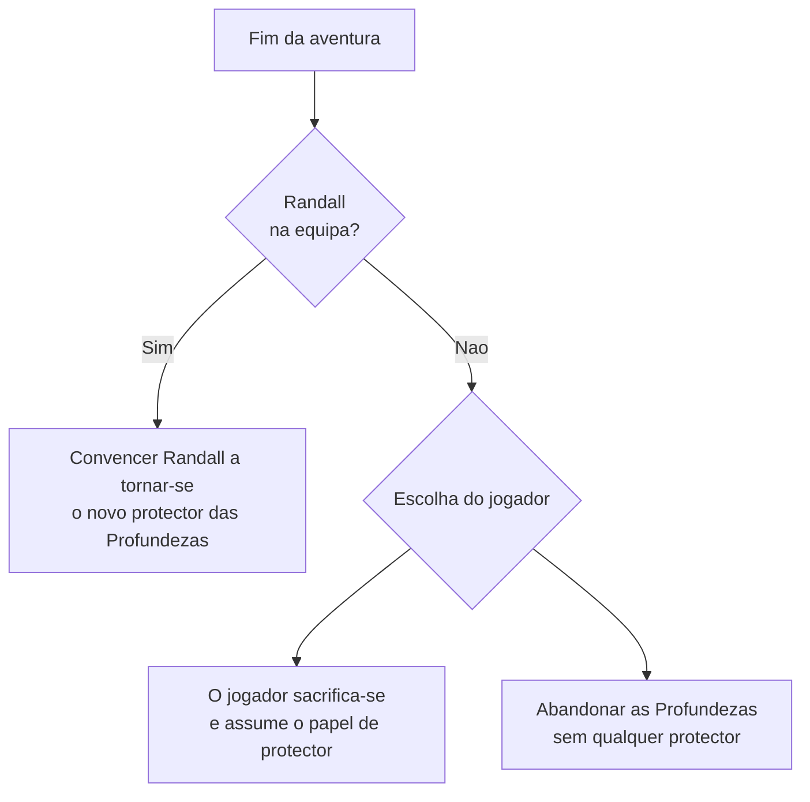
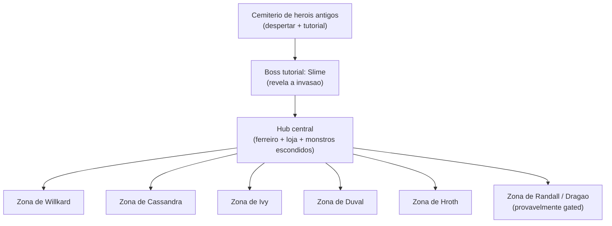

# As Profundezas — Game Design Document

> **Documento vivo.** Isto não é uma especificação fechada — é o registo do pensamento de design à medida que avança. Secções marcadas como "pergunta aberta" ou "proposta a validar" são propositadamente incompletas. Actualizar o changelog (secção 10) sempre que houver uma decisão nova.

**Estado:** primeira versão (esqueleto completo com conteúdo inicial) — 2026-07-15.

**Género:** Action roguelite mobile-first, top-down, inspirado em Vampire Survivors (auto-ataque, escalada de caos, builds) + Soulslike-lite (dodge com i-frames, lock-on, bosses com padrões).

**Premissa:** o jogador é o **monstro**, não o herói. "As Profundezas" era um lar seguro; agora está a ser invadido por um grupo de heróis clichê que veem monstros como recursos infinitos de XP e loot.

---

## 0. Sumário / pitch

**Pitch de uma linha:** *Vampire Survivors encontra Dark Souls, contado do ponto de vista do monstro que só queria ser deixado em paz — enquanto um grupo de heróis-clichê trata o teu lar como uma fazenda de XP.*

**Tom:** comédia satírica. Os heróis são clichés de RPG levados ao exagero de propósito (o cavaleiro arrogante, a bruxa disfarçada, o bárbaro burro, o anão ganancioso, o nobre vingativo). A piada central *é* a crítica: heróis "grindam" um lar alheio como se fosse conteúdo descartável. Isto não impede momentos genuínos — o contraste entre um herói ridículo e um genuinamente triste (ver Ivy) é o que dá textura à comédia, em vez de ficar só a nível de piada única.

**Pilares de design (herdados e adaptados):**
1. **Run-based com hub persistente** — cada incursão numa zona é uma sessão; recursos trazidos de volta financiam o hub.
2. **Escalada de caos** — hordes tipo Survivors dentro de cada zona.
3. **Combate com peso** — dodge com i-frames e lock-on dão profundidade; não é bullet heaven puro.
4. **Estrutura não-linear tipo Souls** — o jogador escolhe a ordem das zonas de boss a partir do hub.
5. **Builds** — armas + buffs (tipo anéis) criam sinergias distintas por run.

---

## 1. História

*Lead: Escritor · Contributos: Game Designer, Business Analyst, Game Programmer*

### 1.1 Abertura (Escritor / Game Designer)

O jogador desperta de um sono profundo num **cemitério de heróis antigos** — um campo de batalha esquecido onde jazem os invasores (e os protectores) de eras passadas. Isto estabelece, sem uma linha de diálogo, que "As Profundezas" já foi invadida antes e que existe uma linhagem de protectores que vieram e se foram.

Nas áreas iniciais o jogador nota estranheza (silêncio errado, marcas de passagem recente) e depara-se com soldados de Willkard a esmagar um **slime** — o primeiro sinal claro de que algo mudou. Segue-se o **boss fight tutorial**: o slime, moribundo, revela que as Profundezas foram invadidas por heróis. É exposição "show, don't tell" — a premissa entra pelo combate, não por um ecrã de texto.

> **Ligação a validar (Ivy):** a Ivy procura um slime raro para curar a irmã. Decidir se o slime tutorial é *esse* slime raro específico (gancho dramático: o jogador destrói sem saber a esperança da Ivy no minuto 1 de jogo) ou um slime comum (mais seguro narrativamente, mas perde-se a oportunidade). Ver secção 9.

### 1.2 Os heróis — clichés de propósito (Escritor)

Cada herói é escrito como um cliché de RPG exagerado. A lista serve de guião de voz para diálogos e para os padrões de combate (secção 4):

| Herói | Cliché | Motivação | Nota de tom |
|---|---|---|---|
| **Willkard** | Cavaleiro dourado arrogante, filho de aristocratas | Regressar ao reino com "uma nova terra sob o seu domínio" para agradar ao pai | Trata conquista como currículo. Cruel, manipulador, maquiavélico — o antagonista principal do grupo. |
| **Cassandra** | A bruxa que esconde a verdadeira identidade para passar por humana | Manter a relação com Willkard e a vida que construiu entre humanos | Ironia central: é *das Profundezas*, mas anda com quem as invade. Potencial ponto de viragem/redenção. |
| **Ivy** | A cientista/alquimista com motivação trágica | Encontrar o slime raro para completar a cura da irmã doente | A única jogada com empatia genuína — contraste deliberado dentro da comédia. |
| **Duval** | O anão obcecado por um minério raro | Descobrir o minério escondido nas Profundezas | Ganância disfarçada de engenho e curiosidade "científica". |
| **Hroth / Tyggel** | O bárbaro burro só-quer-combate | Encontrar um adversário à altura para alcançar um "nível lendário" | É quem desloca a pedra sobre o Cavaleiro Negro (ver 1.3) — força bruta usada sem hesitação moral. **Nome a unificar:** "Hroth" na ficha de personagem, "Tyggel" como possível apelido de batalha (a decidir). |
| **Randall** | O nobre caído em busca de vingança | Recuperar as terras perdidas para o dragão que habita as Profundezas | Único herói com um caminho de redenção claro — pode juntar-se à causa do jogador (ver secção 1.4). |

### 1.3 A queda do Cavaleiro Negro (Escritor / Game Designer)

O Cavaleiro Negro, protector jurado das Profundezas, é derrotado de forma **desonrosa**: Willkard aproxima-se de forma amigável para o distrair enquanto Hroth/Tyggel usa a força para deslocar uma pedra enorme, que cai sobre o Cavaleiro Negro e abre o caminho para a invasão.

Isto acontece **antes** do início jogável — é revelado como uma "Revelação Final" perto do fim da história, não como abertura. Reforça o tema: os heróis não vencem por mérito, vencem por traição.

> **Pergunta aberta:** o final oferece a opção de convencer o Randall a tornar-se o novo protector, "mas isso custará a vida de um dos maiores protectores das Profundezas". Se o Cavaleiro Negro já morreu na Revelação Final, quem é este segundo protector? Precisa de nome e ficha própria, ou de ligação directa a uma personagem já estabelecida (ex.: um mentor do jogador?). Ver secção 9.

### 1.4 Os três finais (Escritor / Game Designer)

Nota de design: o cemitério de heróis antigos (1.1) é o "callback" visual destes finais — sacrificar-se ou o Randall aceitar o cargo significa, literalmente, tornar-se o próximo nome nessa linhagem.

### 1.5 Notas de outras roles

- **Business Analyst:** a premissa "sátira de RPG" é um gancho de marketing forte e barato — trailers podem vender-se sozinhos com a piada ("finalmente, um jogo em que os heróis são o problema"). Vale a pena testar o pitch com público-alvo antes de produção pesada de arte.
- **Game Programmer:** a Revelação Final e os 3 finais implicam um sistema de **flags narrativas** (ex.: `randallRecruited`, `dragonDefeated`) e pelo menos uma cutscene/diálogo ramificado no fim de jogo. Não é complexo tecnicamente, mas precisa de ser desenhado desde já para não ficar hardcoded.

---

## 2. Mapas / Level Design

*Lead: Game Designer · Contributos: Escritor, Business Analyst, Game Programmer*

### 2.1 Estrutura geral — "Firelink Shrine dos monstros" (Game Designer)

- **Tutorial:** cemitério de heróis antigos → área com soldados de Willkard e o slime → boss fight tutorial.
- **Hub central:** onde os monstros sobreviventes se escondem. Tem ferreiro (upgrades de arma permanentes) e loja de itens. Zona 100% segura, ponto de retorno permanente — equivalente ao Firelink Shrine.
- A partir do hub, entradas de masmorra distintas ligam a **zonas de boss** — uma por herói. **Ordem livre**, à semelhança de Dark Souls 1.

### 2.2 Biomas por zona (Game Designer / Escritor)

| Zona | Herói | Bioma sugerido |
|---|---|---|
| Willkard | Cavaleiro dourado | Salão/fortim de acampamento militar improvisado dentro das Profundezas |
| Cassandra | Bruxa disfarçada | Câmaras rituais/espelhos — tema de identidade e ilusão |
| Ivy | Alquimista | Laboratório/pântano alquímico |
| Duval | Anão engenheiro | Veios de minério e forjas escavadas |
| Hroth/Tyggel | Bárbaro | Arena natural de combate, escombros da pedra que caiu sobre o Cavaleiro Negro |
| Randall/Dragão | Nobre + dragão | Covil do dragão — provavelmente a zona mais vertical/aberta, reservada para tarde no jogo |

### 2.3 Pergunta de design em aberto: ordem livre vs. escalada de caos (Game Designer)

"Ordem livre" tipo Souls funciona quando os bosses têm dificuldade relativamente equilibrada entre si, com pequenas variações de "recomendação" (não bloqueios rígidos). Isto entra em tensão directa com o pilar "escalada de caos" (densidade de inimigos cresce com o avanço). Duas abordagens possíveis, a decidir:

1. **Escalada por zona** — cada zona tem a sua própria curva de dificuldade interna, independentemente da ordem de visita. Mais justo, mais trabalho de tuning (cada zona precisa da sua própria progressão de intensidade).
2. **Escalada global** — o jogo todo fica mais difícil (inimigos mais fortes/densos) conforme o número de zonas já limpas, seja qual for a ordem. Mais barato de implementar, mas arrisca zonas "erradas primeiro" sentirem-se injustas.

A zona do Randall/Dragão é a excepção óbvia — soa a superboss tardio, possivelmente **gated** (só acessível após completar N zonas).

### 2.4 Fogueiras (Game Designer / Escritor)

Checkpoints dentro de cada zona-masmorra, para descansar e recuperar vida. Pergunta narrativa a explorar: são também "santuários" reconhecidos pelos monstros como espaços sagrados/seguros? Isso reforçaria a ideia de que o próprio ambiente pertence aos monstros, não aos heróis.

### 2.5 Notas de produção

- **Business Analyst:** 6 zonas de boss + hub + tutorial é um âmbito de conteúdo considerável para uma primeira versão. Vale considerar lançar com um subconjunto (ex.: 3 zonas) e expandir por updates — replicando o modelo de Vampire Survivors (base sólida + DLC/expansões pagas por conteúdo).
- **Game Programmer:** mapeamento directo para Unity — provavelmente **uma cena por zona + uma cena de hub persistente**, com transição por loading/portal em vez de mundo aberto contíguo (mais barato em mobile, mais fácil de fazer streaming de assets por zona).

---

## 3. Inimigos

*Lead: Game Designer · Contributos: Escritor, Business Analyst, Game Programmer*

### 3.1 Papel narrativo (Escritor)

Os inimigos "normais" de cada zona são os monstros que já viviam nas Profundezas — agora caçados pelos heróis para XP e loot. Cada zona pode ter uma pequena "facção" de monstros afinada ao tema do herói que a ocupa (ex.: criaturas alquímicas mutadas na zona da Ivy, por terem sido usadas em experiências).

### 3.2 Papéis de combate (Game Designer)

Proposta inicial de arquétipos (a refinar por zona):
- **Enxame** — fraco individualmente, ameaça em número (alimenta a "escalada de caos").
- **Bloqueador** — força o jogador a lidar com ele antes de avançar (corredores estreitos).
- **Skirmisher à distância** — obriga a movimento/dodge activo em vez de tank-and-spank.
- **Elite de zona** — mini-boss local antes do boss principal da zona.

### 3.3 Notas de outras roles

- **Business Analyst:** variedade de inimigos é um dos maiores custos de produção (arte + animação + IA por tipo). Priorizar 3–4 arquétipos-base reutilizados com variações visuais/paramétricas por zona, em vez de inimigos totalmente únicos por zona.
- **Game Programmer:** o projecto já tem a espinha dorsal necessária — `StateMachine`, `AIState`, `Perception`, `StatePatrol`/`StateChase`/`StateCombat`, `Health`, `Hitbox`. Novos arquétipos devem ser combinações/parametrizações destes sistemas, não reescritas.

---

## 4. Bosses e Mini-Bosses

*Lead: Game Designer · Contributos: Escritor, Business Analyst, Game Programmer*

### 4.1 Boss tutorial: o Slime

Combate propositadamente curto e simples — ensina lock-on, dodge e auto-ataque sem pressão real. A morte do slime entrega a exposição da invasão (ver 1.1). Ver pergunta aberta sobre a ligação à Ivy (secção 9).

### 4.2 Bosses de zona — os heróis

Cada herói nomeado é o boss da sua zona, alcançável em qualquer ordem a partir do hub (ver secção 2). Propostas iniciais de padrão de combate, ligadas ao cliché de cada um:

| Boss | Padrão de combate sugerido |
|---|---|
| **Willkard** | Combate "justo" no papel mas com truques desonestos (chama reforços, ataques pelas costas) — reflecte a sua natureza manipuladora. |
| **Cassandra** | Combina magia com disfarce/ilusão — clones ou inversão de posição, jogando com o tema de identidade escondida. |
| **Ivy** | Combate alquímico à distância (poções/áreas de efeito) — menos agressivo, mais "defensivo-obcecado", coerente com uma personagem que não quer lutar. |
| **Duval** | Uso de minério/armadilhas mecânicas do ambiente da forja — boss de "puzzle de combate". |
| **Hroth/Tyggel** | Boss de força bruta pura — quebra de guarda, ataques de área, possivelmente uma mecânica que ecoa a cena de deslocar a pedra (ex.: atirar destroços). |
| **Randall + Dragão** | Randall é humano/vencível isoladamente; o Dragão é o boss maior/tardio — o combate mais próximo de um "boss soulslike" clássico, com múltiplas fases. |

### 4.3 Telegraphing e ligação técnica (Game Designer / Game Programmer)

Padrões de ataque devem ser lidos e antecipados (estilo soulslike-lite), não apenas colisão instantânea. Tecnicamente, isto liga-se ao que já existe: `CombatManager`, `Hitbox`, `Ability`/`MeleeAttack` — bosses precisam de janelas de telegraph configuráveis antes do hitbox activar (ex.: campo de "tempo de aviso" por ataque).

### 4.4 Notas de outras roles

- **Escritor:** cada boss deve ter uma linha/diálogo curto de entrada e de morte que reforce o cliché e, no caso de heróis com arco de redenção (Cassandra, Randall), plante a semente dessa possibilidade mesmo na primeira luta.
- **Business Analyst:** bosses nomeados e com personalidade forte são o melhor material de marketing (trailers, capturas de ecrã, "boss reveal"). Vale sequenciar o marketing por herói revelado, não por zona genérica.

---

## 5. Gameplay

*Lead: Game Designer + Game Programmer · Contributos: Escritor, Business Analyst*

### 5.1 Controlo e câmara (Game Programmer)

- Câmara top-down, mobile-first.
- Jogador controla direcção via joystick virtual; botão dedicado de esquivar (dodge com i-frames).
- Ataque automático quando um inimigo se aproxima; quando um inimigo está presente e adjacente, entra-se em modo **lock-on**, virado para o inimigo.
- Arma ataca automaticamente de X em X tempo, configurável por arma e por skill.
- Mapeamento directo para scripts já existentes: `PlayerInput`, `CharacterManager`, `CombatManager`, `LockOn`, `Dodge`/`DodgeAbility`, `Ability`/`MeleeAttack`.

### 5.2 Timing como mecânica central (Game Designer)

Estilo Vampire Survivors na estrutura (auto-ataque, escalada, builds), mas com uma camada soulslike: o timing de dodge/lock-on é o que separa "sobreviver à horda" de "ler o boss corretamente". Em Vampire Survivors os inimigos atacam sobretudo por colisão; aqui, inimigos e jogador **partilham habilidades e armas**.

> **Ponto de crítica a resolver:** habilidades partilhadas entre jogador e inimigos são coerentes com o mundo (o mesmo arsenal existe para os dois lados), mas multiplicam o esforço de balanceamento — cada arma/skill precisa de ser testada tanto do lado do jogador como do lado da IA. Vale a pena definir já um subconjunto de habilidades "exclusivas de boss" para não duplicar tudo.

### 5.3 Progressão dentro da run (Game Designer)

- Até **2 buffs simultâneos** (tipo anéis de Dark Souls) — alteram mecânicas de jogo, não só valores.
- Loot de heróis derrotados como fonte natural de buffs/anéis — reforça narrativamente a ideia de "troféu de guerra" (e é engraçado: o jogador literalmente rouba o equipamento clichê do herói).

### 5.4 Notas de outras roles

- **Escritor:** os nomes/descrições dos buffs e armas são espaço fácil para humor adicional (ex.: um anel chamado "Currículo do Willkard" que dá um bónus qualquer irónico).
- **Business Analyst:** o "power fantasy crescente" de Vampire Survivors é o principal motor de retenção de sessão curta em mobile — a curva de builds precisa de ser sentida already nos primeiros 5 minutos de cada run.

---

## 6. Persistência

*Lead: Game Programmer + Business Analyst · Contributos: Game Designer, Escritor*

### 6.1 Sistemas de meta-progressão (Game Designer)

- **Ouro** — ganho em runs, gasto no hub em atributos permanentes (vida máxima, poder de ataque).
- **Minérios** — encontrados nas masmorras, usados no ferreiro do hub para upgrades permanentes de arma.
- **Armas** — todas as que o jogador encontra ficam guardadas no personagem e podem ser levadas em New Game Plus subsequentes.

### 6.2 Justificação narrativa do New Game Plus (proposta a validar)

> **Proposta:** cada New Game Plus é, literalmente, **outro grupo de heróis-clichê** a tentar a mesma coisa — porque a fama das Profundezas (e dos heróis anteriores, vivos ou mortos) atrai sempre mais aventureiros gananciosos. Isto encaixa no tom de sátira já definido (o ciclo nunca aprende) e explica de forma diegética por que razão o jogador volta a "recomeçar" sem quebrar a continuidade da história. A confirmar com o utilizador — ver secção 9.

### 6.3 Arquitectura de save (Game Programmer)

A alto nível, sem código: precisa de separar (a) progresso permanente do hub (ouro gasto, upgrades de arma, armas desbloqueadas) de (b) estado da run actual (posição, buffs activos, zonas já limpas nesta run). Ponderar save local vs. cloud save desde já, mesmo que a primeira versão seja só local — a estrutura de dados deve prever a migração.

### 6.4 Notas de outras roles

- **Business Analyst:** sistemas de progressão permanente (ouro/minério/armas guardadas) são o gancho clássico de retenção "só mais uma run" em jogos deste género — ligar bem à secção 7 (monetização) para não haver sobreposição confusa entre progressão grátis e paga.

---

## 7. Monetização

*Lead: Business Analyst · Contributos: Game Designer, Escritor, Game Programmer*

### 7.1 Benchmark de mercado (Business Analyst)

Vampire Survivors (versão mobile) é a referência de "monetização não-predatória" no género: free-to-play, sem gacha, sem energia, sem pay-to-win; ads **opcionais** para revive/manter ouro no fim da run; expansões pagas e pontuais (DLC). Muitos clones do género usam gacha e battle pass agressivos — é precisamente o que queremos evitar, para não diluir o tom "soulslike justo" que o combate promete.

### 7.2 Proposta inicial de modelo

- **Base do jogo:** free-to-play ou preço único baixo (a decidir por mercado-alvo).
- **Ads:** opcionais, ligados a benefício claro (ex.: revive, bónus de ouro no fim da run) — nunca interrupção forçada.
- **Compras:** cosméticos (skins de arma/personagem) e/ou expansões de conteúdo (novas zonas/heróis) pagas pontualmente. **Sem** vantagens de combate compráveis.
- **Sem energia/vidas limitadas** — contraria o ritmo "uma run rápida a seguir à outra" que o género exige.

### 7.3 Notas de outras roles

- **Escritor:** cosméticos e humor de marketing podem apoiar-se no tom de sátira já definido — skins que exageram ainda mais os tropos dos heróis derrotados (ex.: vestir o equipamento roubado do Willkard de forma ridícula).
- **Game Designer:** qualquer sistema de monetização tem de respeitar o pilar "combate com peso" — nada que substitua a leitura de padrões/timing por poder comprado.
- **Game Programmer:** decidir modelo de monetização agora (mesmo em esqueleto) evita retrabalho de arquitectura de save/loja mais tarde.

---

## 8. Pesquisa de mercado / concorrência

*Recolha inicial — a expandir com jogo real (não só pesquisa web) nas próximas sessões.*

### 8.1 Mesma mecânica (bullet-heaven de acção + dodge/lock-on)

| Jogo | Plataforma | Mecânica-chave | Monetização | O que aprender |
|---|---|---|---|---|
| Halls of Torment | PC / Mobile | Bullet heaven + dodge-roll, estética gótica | Pago (one-time) | Dodge com intenção funciona dentro do molde auto-attack. |
| Death Must Die | PC (mobile em preparação) | Dodge-roll + sistema de "poderes divinos" | A confirmar | Sistemas de poder em camadas dão profundidade sem complicar o input. |
| Soul Knight | Mobile | Twin-stick roguelite de masmorra | F2P, cosméticos | Conteúdo de longo prazo (armas, heróis) sustenta retenção durante anos. |
| Vampire Survivors (mobile) | Mobile | Auto-ataque, escalada, builds | F2P, ads opcionais, sem P2W | Benchmark de monetização justa — referência directa para a secção 7. |
| Unbounded | PC (Early Access) | Bullet hell top-down, cartas de upgrade por boss | A confirmar | Pools de upgrade específicos por boss reforçam identidade de cada luta. |
| Arms of God | PC (Early Access) | Autoshooter de arena, merge de armas | A confirmar | Crafting de build via merge de armas cria sinergias visíveis. |
| Monsters Rush Survivor | Mobile | Clone directo de Vampire Survivors | F2P | Mercado saturado de clones 1:1 — reforça a necessidade de diferenciação forte (ver 8.3). |

### 8.2 Mesma premissa narrativa (jogar do lado do monstro invadido)

| Jogo | Plataforma | Mecânica-chave | Nota |
|---|---|---|---|
| Stop Breaking My Castle! | PC / Mobile | Tower defense — invocar/evoluir monstros | Jogador = Demon Lord, heróis = invasores diários. Mecânica de TD, não acção directa. |
| Keep the Heroes Out | PC | Dungeon defense co-op, baseado em turnos | Jogador controla monstros a defender tesouro; assimétrico, não é acção em tempo real. |
| Castle Doombad | Mobile / PC | Tower defense com armadilhas | Jogador = vilão consagrado; foco em armadilhas/puzzle, não em combate directo. |
| Dungeon Keeper | PC (clássico) | God-game de gestão de masmorra | A raiz do género "sê o mau da fita" — gestão, não acção. |

### 8.3 Conclusão de posicionamento

Nenhum título identificado combina **"jogar como o monstro que defende o lar"** com **bullet-heaven de acção em tempo real com dodge/lock-on**. Os jogos com a mesma premissa narrativa são todos de tower-defense/estratégia; os jogos com a mesma mecânica de acção não têm esta premissa narrativa. **Este cruzamento é o espaço de diferenciação do projecto** — vale a pena protegê-lo no pitch de marketing como o "gancho" principal, junto com o tom de sátira (secção 0).

---

## 9. Perguntas abertas / inconsistências a resolver

Checklist vivo — actualizar à medida que forem decididas.

- [x] ~~Quem é Tyggel?~~ — Resolvido: é o próprio Hroth. **Falta decidir:** qual nome fica como oficial na ficha de personagem (Hroth com "Tyggel" como apelido de batalha, ou o inverso).
- [ ] Quem é "um dos maiores protectores das Profundezas" cujo sacrifício custa convencer o Randall — se o Cavaleiro Negro já morreu na Revelação Final, é outra personagem (a nomear) ou precisa de reformulação do texto do final?
- [x] ~~Tom geral do jogo?~~ — Resolvido: comédia satírica de clichés de RPG, vista do lado do monstro.
- [ ] O slime tutorial é o mesmo slime raro que a Ivy procura, ou um slime comum?
- [ ] Escalada de dificuldade por zona vs. global, dado que a ordem das zonas de boss é livre (secção 2.3).
- [ ] Justificação narrativa do New Game Plus — validar a proposta da secção 6.2 (cada NG+ é outro grupo de heróis-clichê atraído pela fama das Profundezas).
- [ ] Outras questões que forem surgindo nas próximas sessões.

---

## 10. Changelog

| Data | Alterações |
|---|---|
| 2026-07-15 | Criação do documento. Premissa "As Profundezas" fixada como única narrativa do projecto (substitui "Mining RPG" — ver `AGENT.md`). Definido tom (comédia satírica de clichés). Resolvida identidade de Tyggel = Hroth. Definida abertura (cemitério de heróis antigos → slime tutorial) e estrutura de mapa (hub central tipo Firelink Shrine + zonas de boss em ordem livre). Esqueleto completo das 7 áreas com conteúdo inicial em 4 perspectivas (Game Designer, Escritor, Business Analyst, Game Programmer). Pesquisa de mercado inicial (secção 8) com conclusão de posicionamento. |
